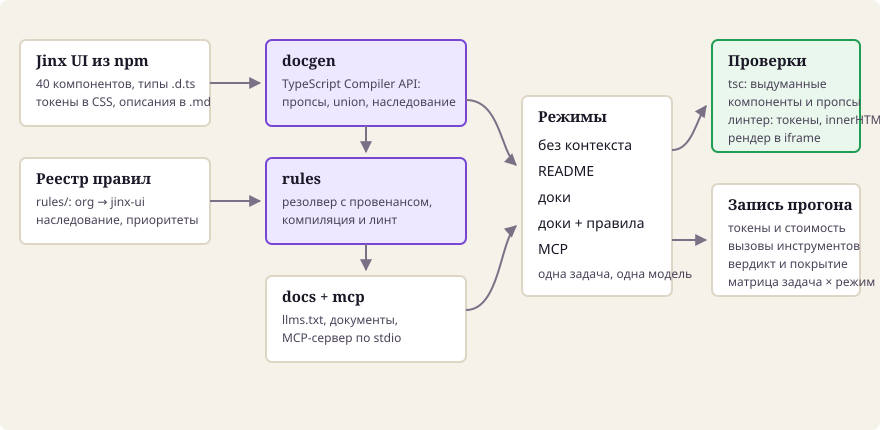
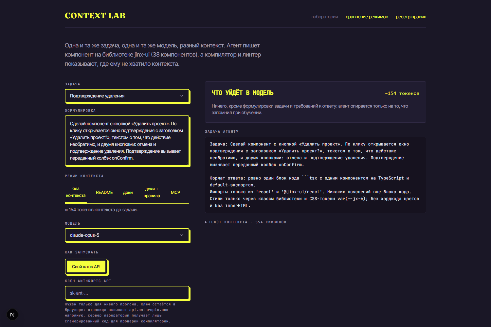
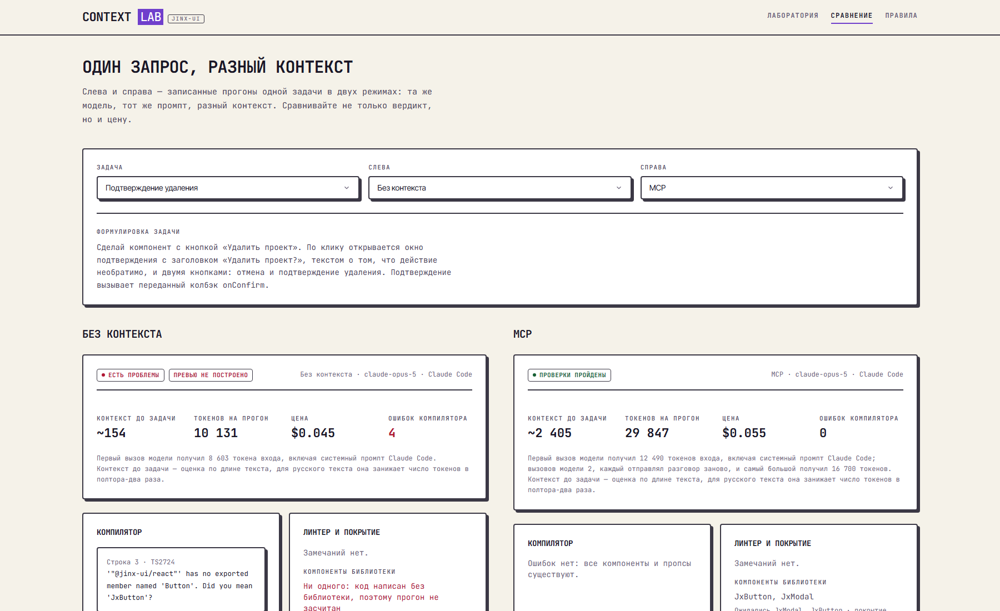
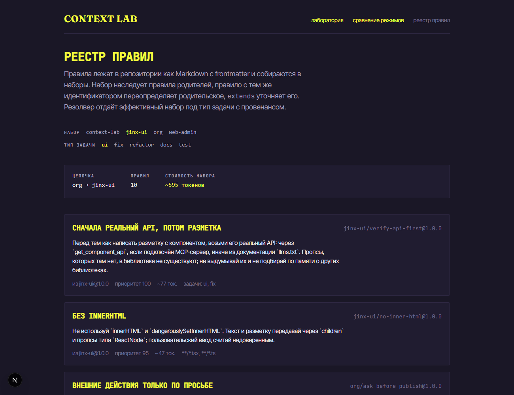

# Context Lab

Инфраструктура AI-контекста для библиотеки React-компонентов и лаборатория, в которой видно, что меняется в коде агента, когда контекста нет, когда есть документация и когда есть MCP-сервер.

Лаборатория: [context-lab-seven.vercel.app](https://context-lab-seven.vercel.app). AI-документация: [loisakilla.github.io/context-lab](https://loisakilla.github.io/context-lab/).

Библиотека-цель: [Jinx UI](https://github.com/loisakilla/Jinx-UI), 40 компонентов, 3 хука, 34 CSS-токена. Своя библиотека взята намеренно: её нет в обучающих данных, поэтому всё, что агент про неё знает, пришло только из контекста, и вклад контекста виден в чистом виде.

<sub>English: a context infrastructure for a React component library (index built with the TypeScript Compiler API, AI-friendly docs, a versioned rule registry with inheritance, an MCP server) plus a web lab that runs the same task in five context modes and grades the generated code with `tsc` and a linter.</sub>



## Зачем

Агент, который не знает вашу библиотеку, ведёт себя предсказуемо плохо: придумывает пропсы, которых нет, берёт компоненты из другой библиотеки с похожим именем, хардкодит цвета вместо токенов. Такой код быстрее переписать, чем починить.

Лечится это не более умной моделью, а контекстом: реальным API из исходников, правилами проекта и инструментами, которые отдают это точечно. Context Lab делает такую инфраструктуру и сразу показывает, что она даёт, в измеримых величинах.

## Что можно потыкать

[Лаборатория](https://context-lab-seven.vercel.app) запускает одну и ту же задачу одной и той же моделью в пяти режимах контекста, рендерит результат и разбирает его. Запустить её можно со своим ключом Anthropic API: ключ остаётся в браузере.

<!-- modes:start -->

| Режим | Что в контексте | Сколько добавляет к запросу |
|---|---|---|
| Без контекста | только формулировка задачи и требования к ответу | ничего |
| README | README npm-пакета `@jinx-ui/react`: установка, модель состояния, `ref`, клавиатура; компоненты названы мимоходом, пропсов нет | ~0,9k токенов |
| Доки | сгенерированный `llms-full.txt` | ~38,8k токенов |
| Доки + правила | то же плюс правила из реестра | ~40,5k токенов |
| MCP | каталог компонентов и токенов в инструкциях сервера и описания шести инструментов; API и правила агент берёт сам через `get_component_api` и `get_rules` | ~3,9k токенов плюс ответы инструментов |

<!-- modes:end -->

Цена контекста посчитана по записанному расходу прогонов: сколько токенов режим добавил к первому запросу по сравнению с режимом без контекста.

Для каждого прогона видно: сгенерированный код, живой рендер на Jinx UI, ошибки компилятора с выделенными выдуманными компонентами и пропсами, нарушения правил, вызовы инструментов, токены и стоимость.

До запуска на той же странице виден сам контекст: сколько токенов уйдёт в модель, из каких источников он собран и какой текст получит агент.



Страница `/compare` ставит рядом два режима на одной задаче: слева обычно выдуманные компоненты и красный вердикт, справа компилируемый код. Страница `/rules` показывает реестр правил глазами резолвера — с цепочкой наследования, провенансом и бюджетом.

Интерфейс лаборатории собран на самой Jinx UI — светлая тема, стиль `brutal`. Селекты, вкладки, бейджи, таблица и кнопки на странице те же, что агент получает в документации, поэтому сгенерированный компонент в кадре превью выглядит частью страницы. Заодно это проверка библиотеки на себе: её реальные слабые места описаны в [.agents/context/DESIGN.md](.agents/context/DESIGN.md).



## Результаты

Одна задача выглядит так. Без контекста агент уверенно пишет разметку на компонентах, которых в библиотеке нет:

```tsx
import { Button, Dialog } from '@jinx-ui/react';
```

```
'"@jinx-ui/react"' has no exported member named 'Button'. Did you mean 'JxButton'?
Module '"@jinx-ui/react"' has no exported member 'Dialog'.
```

С той же задачей и сгенерированной документацией он берёт настоящие компоненты и настоящие пропсы:

```tsx
import { JxButton, JxModal } from '@jinx-ui/react';
```

<!-- matrix:start -->

Модель claude-opus-5, библиотека jinx-ui 0.1.1, драйвер Claude Code по подписке, прогонов 165, задач 11, по 3 прогона на ячейку. В ячейках медианы.

| Режим | Задач, где прошли все прогоны | Ошибок компилятора на задачу | Нарушений правил | Покрытие нужных компонентов |
|---|---|---|---|---|
| Без контекста | 0 из 11 | 6.5 | 0.0 | 0% |
| README | 4 из 11 | 1.3 | 0.0 | 54% |
| Доки | 11 из 11 | 0.0 | 0.0 | 100% |
| Доки + правила | 10 из 11 | 0.0 | 0.0 | 100% |
| MCP | 11 из 11 | 0.0 | 0.0 | 92% |

| Режим | Вход первого вызова | Из них контекст режима | Самый большой запрос | Новых токенов на задачу | Из кэша | Цена задачи | Вызовов модели | Секунд |
|---|---|---|---|---|---|---|---|---|
| Без контекста | 8 604 ток. | — | 8 604 ток. | 2 176 ток. | 8 602 ток. | $0.056 | 1.0 | 24 |
| README | 9 540 ток. | +936 ток. | 9 540 ток. | 2 938 ток. | 9 538 ток. | $0.075 | 1.0 | 30 |
| Доки | 47 357 ток. | +38 753 ток. | 47 357 ток. | 929 ток. | 47 355 ток. | $0.047 | 1.0 | 10 |
| Доки + правила | 49 062 ток. | +40 458 ток. | 49 062 ток. | 1 228 ток. | 49 060 ток. | $0.055 | 1.0 | 12 |
| MCP | 12 491 ток. | +3 887 ток. | 17 693 ток. | 5 804 ток. | 32 848 ток. | $0.091 | 2.4 | 22 |

Вход первого вызова — сколько токенов получил первый запрос к модели, по записанному расходу. У Claude Code в него входит собственный системный промпт, поэтому даже без контекста это 8,6k; контекст режима — разница с режимом без контекста.

Самый большой запрос — наибольший вход одного вызова модели за задачу: столько места режим занимает в окне контекста.

Новых токенов — то, что модель за задачу получила впервые или написала сама: вход мимо кэша, запись в кэш и вывод. Из кэша — то, что каждый следующий вызов отправляет заново и модель перечитывает за десятую часть цены входа: системный промпт, описания инструментов и прошлые ответы инструментов.

Цена посчитана из записанного расхода токенов по тарифу Anthropic для модели прогона.

<details><summary>По задачам: сколько прогонов прошли проверки и медиана ошибок компилятора</summary>

| Задача | Без контекста | README | Доки | Доки + правила | MCP |
|---|---|---|---|---|---|
| Настройки внешнего вида | ❌ 0/3 · 11 ош. | ❌ 0/3 · 3 ош. | ✅ 3/3 · 0 ош. | ✅ 3/3 · 0 ош. | ✅ 3/3 · 0 ош. |
| Подтверждение удаления | ❌ 0/3 · 4 ош. | ✅ 3/3 · 0 ош. | ✅ 3/3 · 0 ош. | ✅ 3/3 · 0 ош. | ✅ 3/3 · 0 ош. |
| Выбор периода | ❌ 0/3 · 5 ош. | ⚠️ 2/3 · 0 ош. | ✅ 3/3 · 0 ош. | ✅ 3/3 · 0 ош. | ✅ 3/3 · 0 ош. |
| Приглашение в команду с валидацией | ❌ 0/3 · 7 ош. | ❌ 0/3 · 4 ош. | ✅ 3/3 · 0 ош. | ✅ 3/3 · 0 ош. | ✅ 3/3 · 0 ош. |
| Форма настроек | ❌ 0/3 · 10 ош. | ❌ 0/3 · 3 ош. | ✅ 3/3 · 0 ош. | ✅ 3/3 · 0 ош. | ✅ 3/3 · 0 ош. |
| Боковая панель навигации | ❌ 0/3 · 5 ош. | ✅ 3/3 · 0 ош. | ✅ 3/3 · 0 ош. | ✅ 3/3 · 0 ош. | ✅ 3/3 · 0 ош. |
| Подписка с уведомлением | ❌ 0/3 · 7 ош. | ❌ 0/3 · 2 ош. | ✅ 3/3 · 0 ош. | ✅ 3/3 · 0 ош. | ✅ 3/3 · 0 ош. |
| Выбор тегов | ❌ 0/3 · 3 ош. | ❌ 0/3 · 1 ош. | ✅ 3/3 · 0 ош. | ⚠️ 2/3 · 0 ош. | ✅ 3/3 · 0 ош. |
| Панель расхода с фильтрами | ❌ 0/3 · 9 ош. | ✅ 3/3 · 0 ош. | ✅ 3/3 · 0 ош. | ✅ 3/3 · 0 ош. | ✅ 3/3 · 0 ош. |
| Таблица пользователей с пагинацией | ❌ 0/3 · 4 ош. | ✅ 3/3 · 0 ош. | ✅ 3/3 · 0 ош. | ✅ 3/3 · 0 ош. | ✅ 3/3 · 0 ош. |
| Пошаговая форма | ❌ 0/3 · 6 ош. | ⚠️ 1/3 · 1 ош. | ✅ 3/3 · 0 ош. | ✅ 3/3 · 0 ош. | ✅ 3/3 · 0 ош. |

</details>

<details><summary>Те же задачи на другой модели</summary>

| Модель | Режим | Задач, где прошли все прогоны | Ошибок компилятора на задачу | Вызовов модели | Цена задачи |
|---|---|---|---|---|---|
| claude-opus-5 | Без контекста | 0 из 11 | 6.5 | 1.0 | $0.056 |
| claude-opus-5 | README | 4 из 11 | 1.3 | 1.0 | $0.075 |
| claude-opus-5 | Доки | 11 из 11 | 0.0 | 1.0 | $0.047 |
| claude-opus-5 | Доки + правила | 10 из 11 | 0.0 | 1.0 | $0.055 |
| claude-opus-5 | MCP | 11 из 11 | 0.0 | 2.4 | $0.091 |
| claude-sonnet-5 | Без контекста | 0 из 11 | 8.5 | 1.0 | $0.012 |
| claude-sonnet-5 | README | 0 из 11 | 2.2 | 1.0 | $0.027 |
| claude-sonnet-5 | Доки | 10 из 11 | 0.0 | 1.0 | $0.018 |
| claude-sonnet-5 | Доки + правила | 10 из 11 | 0.0 | 1.0 | $0.022 |
| claude-sonnet-5 | MCP | 10 из 11 | 0.0 | 2.3 | $0.034 |

</details>

<!-- matrix:end -->

Что из этого следует.

Решает контекст, а не модель. Без контекста ни opus-5, ни sonnet-5 не проходят ни одной задачи из одиннадцати: шесть с половиной и восемь с половиной ошибок компилятора на задачу, нулевое покрытие нужных компонентов. С документацией или MCP обе модели проходят 32–33 прогона из 33, и слабая модель с настоящим API почти не уступает сильной.

README npm-пакета — промежуточный случай, и самый поучительный. Пропсов в нём нет, компоненты названы мимоходом: два в примере установки, ещё семь в разделе про `ref`. Этого хватает, чтобы модель усвоила соглашение `Jx*` и стала угадывать остальное. У opus-5 догадки о компонентах почти всегда верные — из четырнадцати названий существуют двенадцать, — и ошибки переезжают в пропсы: `onCheckedChange` у `JxSwitch`, `id` у `JxSelect`, `variant` у `JxAlert`, всё по памяти о других библиотеках. Так у opus-5 проходят 15 прогонов из 33 и четыре задачи целиком. Sonnet-5 угадывает хуже, из двадцати восьми названий существуют семнадцать, и проходит 7 прогонов из 33, но ни одной задачи во всех трёх повторах. Угадывание даёт правдоподобный код, а не надёжный.

Дальше сравнивать приходится не «работает или нет», а цену. Здесь измерение сначала опровергло простую версию «MCP всегда дешевле», а потом показало, на что сервер тратил лишнее.

Документация добавляет к каждому запросу около 39k токенов, но это один и тот же блок, и он целиком уходит в кэш: первый прогон стоит около $0,27, повторные — $0,04. У MCP контекст до задачи маленький, зато каждый следующий вызов модели отправляет весь разговор заново: системный промпт Claude Code, описания инструментов и все прошлые ответы. В первой записи задание требовало сначала найти компоненты поиском и только потом брать их API, а за дизайн-токенами opus-5 ходил отдельным ходом. Выходило почти четыре вызова модели, 66k токенов и $0,148 на задачу, хотя самих ответов инструментов было 5–8k.

Тогда сервер стал отдавать в инструкциях каталог: строку на каждый компонент и имена токенов, около 1,3k токенов. Теперь агент в первом же ходе берёт API нужных компонентов вместе с правилами, а к поиску не обратился ни разу. У opus-5 вызовов модели стало 2,4 вместо 3,8, токенов 38k вместо 66k, цена $0,091 вместо $0,148, и прошли все 33 прогона. У sonnet-5 35k токенов вместо 58k и $0,034 вместо $0,049. По токенам MCP теперь дешевле документации с её 48k, а самый большой его запрос — 18k против 47k. По деньгам тёплая документация всё ещё выигрывает: блок в 39k читается из кэша за десятую часть цены, а ответы инструментов у каждой задачи свои и каждый раз пишутся в кэш заново. Это тот же цикл, что и с `ref` ниже, только дыра на этот раз нашлась в сервере, а не в библиотеке.

Размен такой: документация дешевле при частых однотипных запросах со стабильным контекстом, MCP — когда дорого окно, потому что его делят с кодом пользователя, или когда библиотека слишком велика, чтобы влезть целиком.

Правила поверх документации на компилируемость не влияют: разница у обеих моделей не больше одного прогона из тридцати трёх, и провалы не про правила. Sonnet-5 и с правилами, и без них один раз из трёх добавляет `JxAlert` проп `onClose`, как принято в других библиотеках; opus-5 один раз вешает `id` на `JxTagInput`, у которого такого пропса нет. Ценность правил не в компилируемости, а в единообразии — токены вместо хардкода цветов, префиксы классов, отсутствие `innerHTML`.

Отдельная находка — правило против API, и она уже исправлена. Набор правил jinx-ui требует возвращать фокус на триггер, когда слой закрывается. Opus-5 в режиме MCP первым делом вызывает `get_rules` и выполняет это правило буквально: заводит `useRef` и вешает `ref` на кнопку или поле. В Jinx UI 0.1.0 типы компонентов `ref` не принимали, хотя во время выполнения React 19 доводил его до `<button>`, и все три провала opus-5 в режиме MCP были такими; вдобавок в описании `JxModal` не было сказано, что модалка возвращает фокус сама. В 0.1.1 компоненты принимают `ref`, а описание говорит про фокус. В новой матрице opus-5 вешает `ref` в четырёх прогонах, и все четыре компилируются, а в «Подтверждении удаления» фокус вручную больше не возвращает. Прежняя матрица лежит в `data/runs/0.1.0`. Так и задуман цикл: измерение нашло дыру в библиотеке, библиотеку поправили, следующее измерение это подтвердило.

### Условия эксперимента

Агент работает в пустой папке вне репозитория, и у него нет ни одного инструмента: встроенные выключены, внешние MCP-серверы не наследуются, настройки среды не подхватываются. В режимах без MCP это значит, что открыть исходники библиотеки он физически не может, а в режиме MCP ему разрешены ровно шесть инструментов сервера: поиск, API компонента, примеры, токены, документация и правила. Те же шесть инструментов получают драйвер Anthropic API и лаборатория со своим ключом. Условия не надо принимать на слово: в каждой записи прогона лежат все ходы и вызовы инструментов, а отдельный тест следит, чтобы драйвер не растерял эти флаги.

Прогон засчитан, только если код проходит компилятор и линтер и использует хотя бы один компонент библиотеки. Без последнего условия разметка на голом HTML с классами `jx-*` считалась бы успехом.

Claude Code отправляет модели и собственный системный промпт: драйвер дописывает наш промпт к нему, а не заменяет его. Поэтому вход первого вызова у всех режимов на ~8,6k больше контекста режима, и токены этих прогонов нельзя сравнивать с прогонами через API напрямую — только разницу между режимами.

Все прогоны в этих таблицах записаны против опубликованного `@jinx-ui/react@0.1.1` — того же пакета, из которого лаборатория собирает контекст. Прежние записи лежат рядом: `data/runs/0.1.0` — та же матрица до исправления `ref`, `data/runs/0.1.0@63b81b6` — ещё до публикации в npm. В той версии на два компонента меньше, а режим README читал README репозитория, после которого модели писали разметку на классах `jx-*` без компонентов, и ни один такой прогон не засчитывался.

Ограничения этих цифр: три прогона на ячейку и медианы, две модели, одиннадцать задач, библиотека, которой нет в обучающих данных. Цена зависит от кэша: повторы одной ячейки идут подряд, поэтому блок документации успевает нагреться, и медиана ближе к «тёплой» цене, чем к первому запросу. Все 330 прогонов этой записи дошли до кода, ответов без кода нет. Запись прерывалась на лимите подписки: упавшие ячейки не записались и были дописаны после сброса тем же `--resume`. Две ячейки, которые лимит разорвал посередине, записаны заново целиком, чтобы их повторы шли подряд, как у остальных, и холодный кэш после паузы не завысил цену. Ячейки MCP обеих моделей записаны заново после того, как сервер стал отдавать каталог; первая запись MCP осталась в истории репозитория, в коммите `dd0a46f`. Первую ячейку перезаписи у каждой модели пришлось записать ещё раз по той же причине: её первый прогон пришёлся на холодный кэш после паузы.

## Как устроено

| Пакет | Назначение |
|---|---|
| `packages/docgen` | Индекс компонентов и токенов из установленного пакета: TypeScript Compiler API с настоящим `ts.Program` — типы из `.d.ts`, дефолты и CSS-классы из скомпилированного `.js`, разбор пересечений, union-значений и наследования; токены через postcss |
| `packages/docs` | AI-дружественная документация: `llms.txt`, `llms-full.txt`, документ на компонент, линт описаний против типов |
| `packages/index-tools` | Поиск по компонентам, выдача API в бюджете токенов, определения инструментов — одна реализация для MCP и для браузера |
| `packages/rules` | Реестр правил с наследованием наборов, провенансом, бюджетом, линтом и компиляцией в `CLAUDE.md`, `AGENTS.md`, `.cursor/rules/*.mdc`, `.github/copilot-instructions.md` |
| `packages/checks` | Проверка сгенерированного кода компилятором (`typescript` + `@typescript/vfs`) и линтером по AST |
| `packages/runner` | Прогон задачи: сборка контекста, драйверы Claude Code и Anthropic API, запись прогона, матрица |
| `packages/mcp` | MCP-сервер поверх индекса, документации и правил |
| `apps/lab` | Веб-лаборатория на Next.js |

Пропсы извлекает не разбор синтаксиса, а настоящий type checker: у Jinx UI они объявлены пересечениями вроде `ButtonHTMLAttributes<HTMLButtonElement> & { variant?: JxButtonVariant }`, компоненты завёрнуты в `forwardRef`, часть пропсов приходит из `@types/react`. Синтаксический парсер на этом ломается и выдаёт либо пустоту, либо свалку из двухсот HTML-атрибутов.

Инвариант: индекс и документация собираются из установленной версии библиотеки, правила — из реестра `rules/`, а CI падает, если закоммиченные артефакты разошлись с источником.

### Библиотека

Jinx UI подключена обычными npm-пакетами `@jinx-ui/core`, `@jinx-ui/react` и `@jinx-ui/tokens` с точной версией — в корневом `package.json` для инструментов и в `apps/lab` для самой лаборатории. Точная, а не диапазон, потому что библиотека здесь объект эксперимента: прогон, записанный сегодня, должен ссылаться ровно на ту версию, которую видел агент. Версия в npm неизменяема, поэтому она и служит идентификатором библиотеки в индексе и в записях прогонов.

Чтобы перейти на новую версию, поднимите её в обоих `package.json`, выполните `npm install`, затем `npm run index`, `npm run docs:build` и `npm run lab:prepare`. Прогоны лежат по папкам версий, `data/runs/<версия>`: новые записи ложатся рядом со старыми и не затирают их, `--resume` пропускает только ячейки своей версии, а `npm run matrix` собирает матрицу по текущей версии и берёт другую через `--library`.

Репозиторий живёт по собственным правилам: корневой `CLAUDE.md` подключает набор `context-lab`, скомпилированный тем же резолвером, что работает в лаборатории.

## Быстрый старт

Нужен Node.js 22.12+, 24 или 26+: так требует vitest 5.

```bash
git clone https://github.com/loisakilla/context-lab.git
cd context-lab
npm ci
npm run verify
npm run lab:dev
```

`npm run verify` прогоняет проверку типов в пакетах и скриптах, 149 тестов в 14 файлах, а также сверяет индекс, документацию и скомпилированные правила с источником. Среди тестов — сквозной для MCP-сервера через настоящий stdio-клиент из SDK, прогон со своим ключом на подменённой сети, где видно, что ключ уходит только в Anthropic, а также песочница превью и флаги драйвера.

## MCP-сервер за минуту

В корне репозитория уже лежит `.mcp.json`, поэтому Claude Code подхватит сервер сам. Для другого проекта достаточно такой записи:

```json
{
  "mcpServers": {
    "context-lab": {
      "command": "node",
      "args": ["node_modules/tsx/dist/cli.mjs", "packages/mcp/src/cli.ts", "serve", "--config", "context-lab.config.json"]
    }
  }
}
```

Сервер отдаёт шесть инструментов: `search_components`, `get_component_api`, `get_component_examples`, `list_design_tokens`, `get_docs`, `get_rules`, промпт `jinx_rules` и ресурсы с обзором библиотеки и `llms.txt`. Каждый ответ укладывается в бюджет токенов и при переполнении сообщает, что именно опущено, вместо молчаливой обрезки. На несуществующий компонент сервер отвечает ошибкой со списком похожих имён и прямым запретом выдумывать пропсы.

В `instructions` сервер кладёт каталог: по строке на каждый из сорока компонентов и имена токенов, около 1,3k токенов. По каталогу агент сразу знает, какие компоненты ему нужны, и запрашивает их API одним ходом вместе с правилами; поиск нужен, только если подходящего компонента в каталоге нет.

## Правила как данные

Правила лежат в `rules/` как Markdown с frontmatter. Наборы наследуются (`jinx-ui` наследует `org`), одноимённое правило переопределяет родительское, `extends` уточняет его с сохранением области применения. Резолвер отдаёт эффективный набор с провенансом:

```bash
npm run rules:resolve -- jinx-ui --task ui
```

```
Набор jinx-ui, цепочка org → jinx-ui, правил 10, ~595 токенов
  jinx-ui/verify-api-first@1.0.0 · из jinx-ui@1.0.0 · приоритет 100 · ~77 токенов
  org/no-code-comments@1.1.0 · из org@1.0.0 · приоритет 90 · ~71 токенов
  ...
```

`npm run rules:compile` собирает из одного источника файлы для Claude Code, Cursor, Copilot и формат `AGENTS.md`, а `npm run rules:check` в CI ловит расхождение. Линтер реестра находит дубликаты, конфликты, слишком длинные правила и расплывчатые формулировки вроде «по возможности», на которые агент реагирует непредсказуемо.



## Запись прогонов

```bash
npm run tasks
npm run run -- --task settings-form --mode all --driver claude-code --model claude-opus-5 --repeat 3 --resume
npm run matrix
```

Прогоны идут через Claude Code по подписке, записи ложатся в `data/runs/<версия библиотеки>`, матрица с медианами и долей успешных прогонов — в `data/matrix.json`, откуда её читает лаборатория. Записи закоммичены намеренно: любую цифру из README можно открыть и посмотреть, какой код за ней стоит. Флаг `--resume` пропускает уже записанные ячейки, поэтому длинную матрицу можно набирать партиями.

Если `claude -p` отвечает `Not logged in`, выполните один раз `claude auth login` в терминале (или /login в интерактивной сессии): учётные данные десктопного приложения дочернему процессу недоступны. На Windows бинарник ставится в `%USERPROFILE%\.local\bin`, которого может не быть в PATH.

Второй способ — свой ключ Anthropic прямо в браузере. Ключ хранится только в браузере посетителя, запросы идут напрямую в `api.anthropic.com`, на сервер лаборатории попадает лишь сгенерированный код для проверки компилятором.

Сгенерированный код исполняется в iframe без `allow-same-origin`, поэтому у него opaque origin: попытка дотянуться до хранилища страницы с ключом заканчивается `SecurityError`, а собственная политика безопасности страницы превью запрещает ей любые сетевые запросы.

### Как записана опубликованная матрица

Через Claude Code по подписке, по три прогона на ячейку:

```bash
npm run run -- --task all --mode all --driver claude-code --model claude-opus-5 --repeat 3 --resume
npm run run -- --task all --mode all --driver claude-code --model claude-sonnet-5 --repeat 3 --resume
npm run matrix -- --driver claude-code --model claude-opus-5
npm run matrix -- --driver claude-code --model claude-sonnet-5 --out data/matrix-claude-sonnet-5.json
npm run readme
```

Фильтры у `matrix` обязательны, когда в папке версии лежат записи разных драйверов или моделей: без них матрица откажется собираться и попросит выбрать одну модель и один драйвер.

Если нет ни подписки, ни ключа, остаётся третий способ: задания выгружаются в файлы, каждую ячейку выполняет отдельный агент, ответы складываются в `data/outputs`, а записи собираются из них теми же проверками.

```bash
npm run prompts
npm run record -- --model claude-sonnet-5
npm run matrix -- --driver subagent --model claude-sonnet-5
```

Условия такого эксперимента: агент видит ровно один файл задания и не имеет права открывать исходники библиотеки, искать по коду и запускать команды; в режиме MCP ему дополнительно разрешены только инструменты сервера `context-lab`. Записи помечаются драйвером `subagent`, расхода токенов и цены в них нет, поэтому по ним видно только размер поданного контекста. Первые сорок прогонов проекта записаны так и лежат в `data/runs/0.1.0@63b81b6` вместе с прежней матрицей.

## Что считается ошибкой

- Компонент или проп, которых нет в библиотеке: ошибка `tsc`, в отчёте выделяется отдельно.
- Значение union-пропса вне допустимого списка.
- Цвет строкой `#hex`, `rgb()`, `hsl()` вместо токена `var(--jx-*)`.
- `innerHTML` и `dangerouslySetInnerHTML`.
- Импорт вне списка разрешённых модулей.
- Падение при рендере в изолированном iframe.

Прогон считается успешным, когда нет ошибок компилятора, нет нарушений уровня error и компонент отрисовался.

## Честные ограничения

- Матрица записывается вручную и фиксирует конкретные модель и версию библиотеки; это не бенчмарк моделей, а измерение вклада контекста.
- Оценка токенов в предпросмотре контекста приблизительная. Фактические токены в записи прогона берутся из ответа API или из отчёта Claude Code, а цену раннер считает из них сам по тарифу Anthropic: Claude Code в своём отчёте посчитал sonnet-5 по тарифу opus-5, в два с половиной раза дороже.
- Локальный роут с запуском Claude Code включается только переменной `CONTEXT_LAB_LOCAL=1` и не предназначен для публичного развёртывания.

## Лицензия

MIT.
